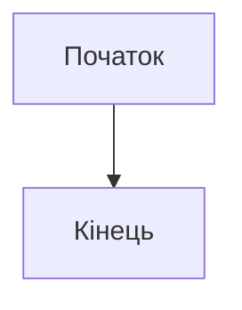
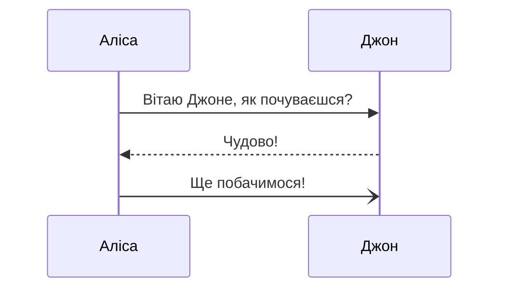
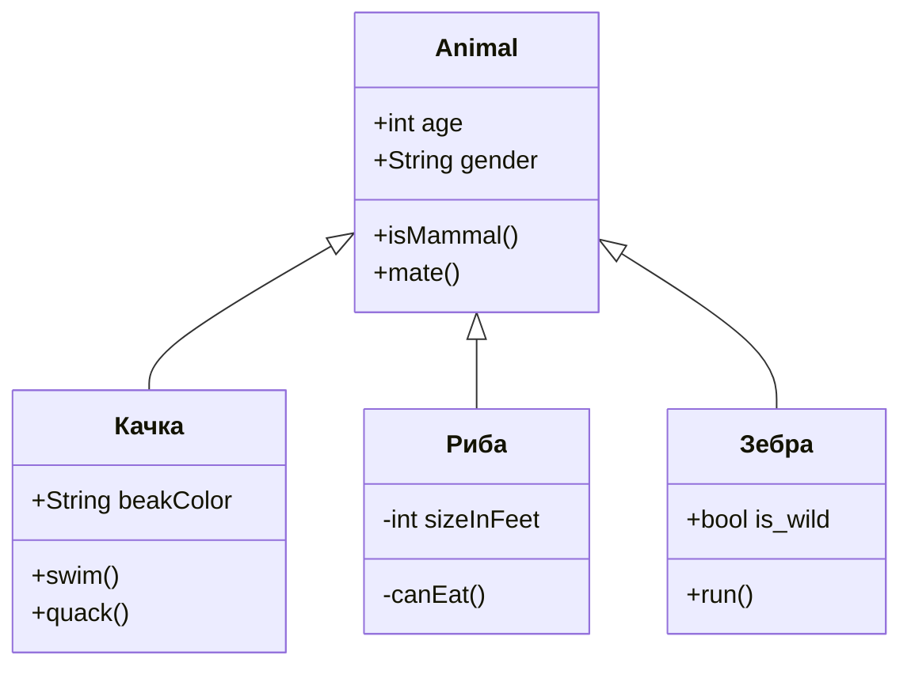
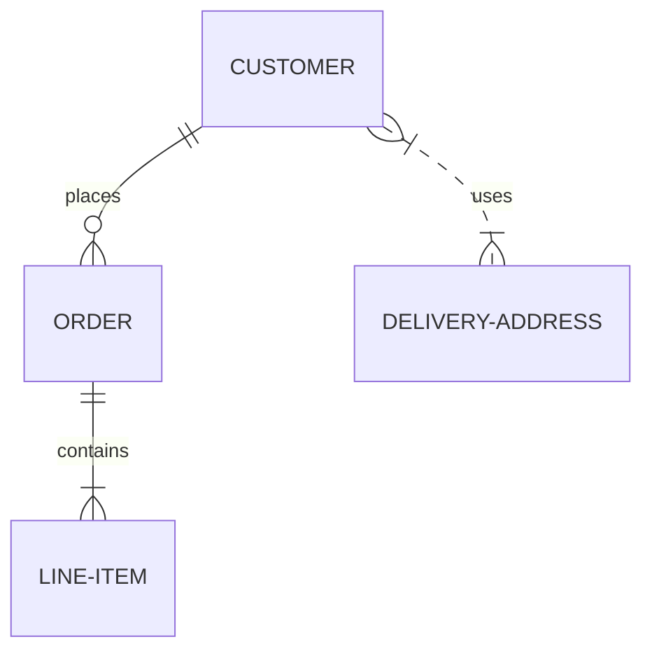
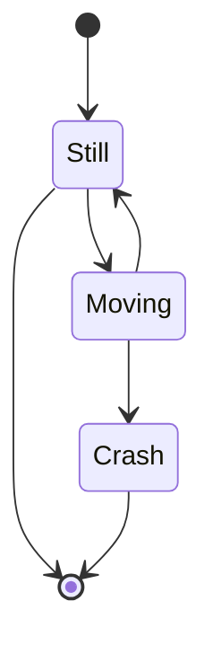
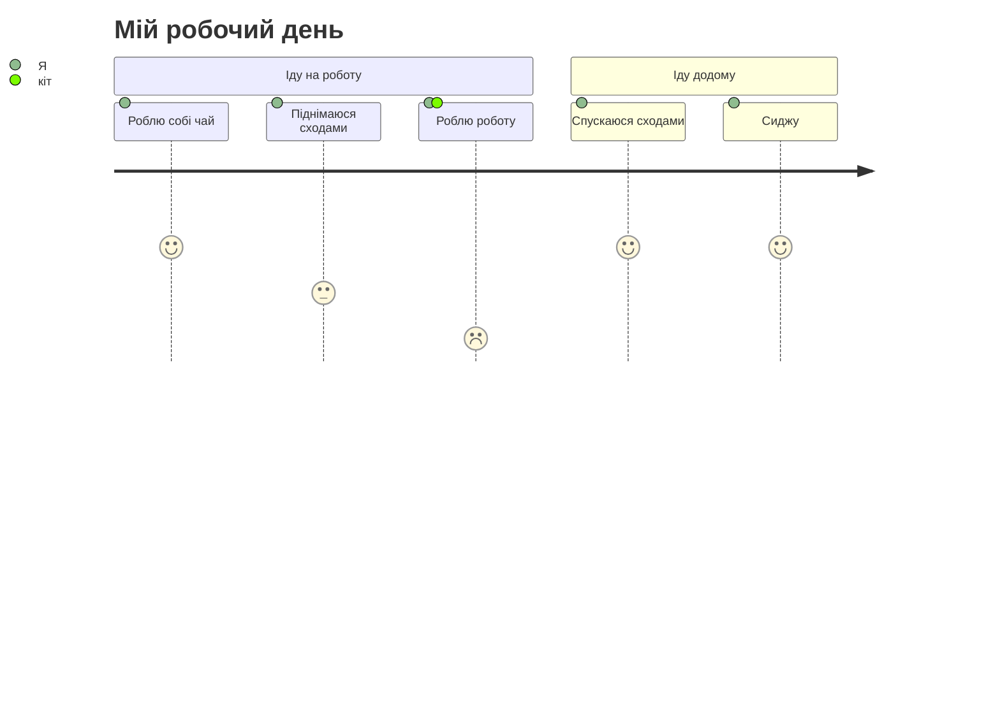
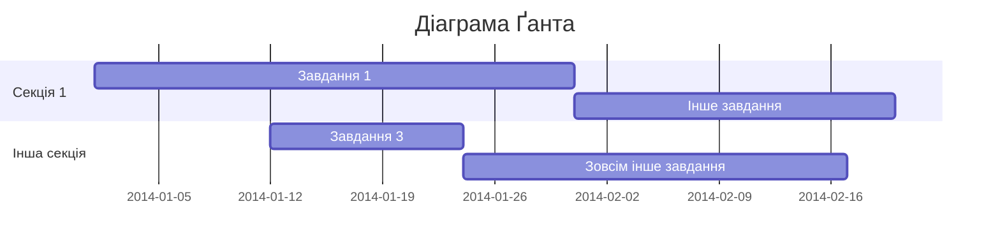
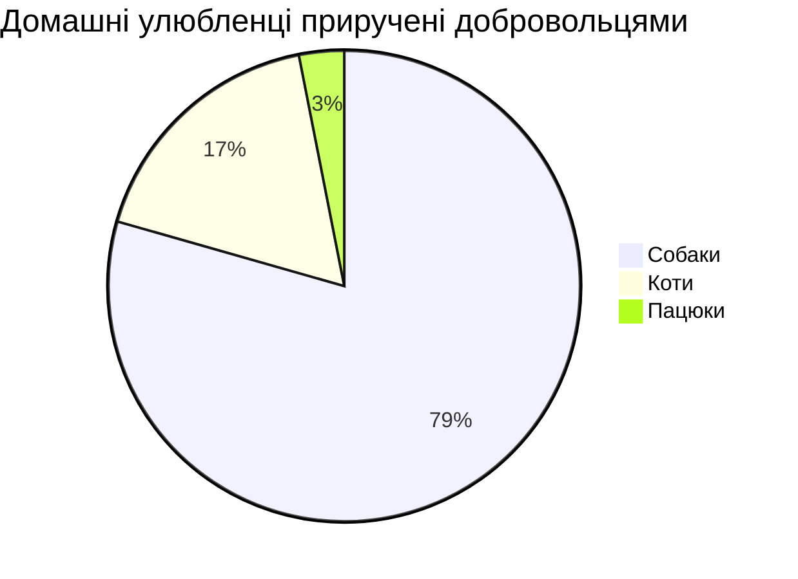

## Основний синтаксис Markdown

I just love **bold text**. Italicized text is the _cat's meow_. At the command prompt, type `nano`.

My favorite markdown editor is [ByteMD](https://github.com/bytedance/bytemd).

Редактор з підсвіткою та переглядом: https://bytemd.netlify.app/ .

Список:
1. First item
2. Second item
3. Third item

Цитата:
> Dorothy followed her through many of the beautiful rooms in her castle.

Блок коду з підсвіткою:
```js
import { Editor, Viewer } from 'bytemd'
import gfm from '@bytemd/plugin-gfm'

const plugins = [
  gfm(),
  // Add more plugins here
]

const editor = new Editor({
  target: document.body, // DOM to render
  props: {
    value: '',
    plugins,
  },
})

editor.on('change', (e) => {
  editor.$set({ value: e.detail.value })
})
```

## Git Flavoured Markdown

Автоматичне перетворення URL на посилання: https://github.com/bytedance/bytemd

~~Закреслений текст.~~ Звичайний текст.

TODO:
- [x] Зробити щось.
- [ ] Потім ще щось.
- [ ] Відпочити від роботи.

Таблиця:
| Стовпець1 | Стовпець два |
| --------- | -----------  |
| Комірка   | Комірка      |
| Комірка   | Комірка      |

## Зноски

Проста зноска[^1] і довга зноска.[^довга_зноска]

[^1]: Це проста зноска.
[^довга_зноска]: Це довга зноска з кількома параграфами тексту.

    Відступіть текст для включення його у довгу зноску.

    `{ my code }`

    $a+b=c$

    Додавайте стільки параграфів, скільки вам потрібно.

## Математичні формули

Вбудовані формули: $a+b$

$$
\displaystyle \left( \sum_{k=1}^n a_k b_k \right)^2 \leq \left( \sum_{k=1}^n a_k^2 \right) \left( \sum_{k=1}^n b_k^2 \right)
$$

## Зображення


## Діаграми Mermaid


















## Вбудовані обʼєкти:

Ютуб:

https://www.youtube.com/watch?v=5D4YVRdeGzs

Твіттер:

https://twitter.com/lviv1256/status/1307545411410972672

